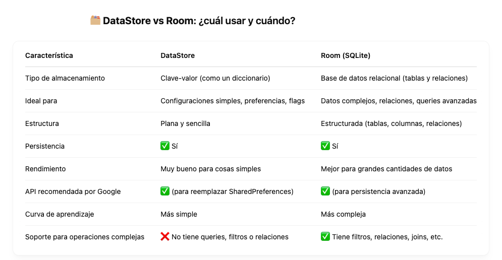

# DataStore

Guardar las últimas búsquedas como texto podría hacerse más fácil y rápido con DataStore.

> Cuando usar dataStore
    - Quieres guardar listas simples (como strings o flags).
    - Necesitas guardar configuraciones o estados (modo oscuro, nombre de usuario, último valor buscado, etc.).
    - Buscas algo rápido y liviano.

